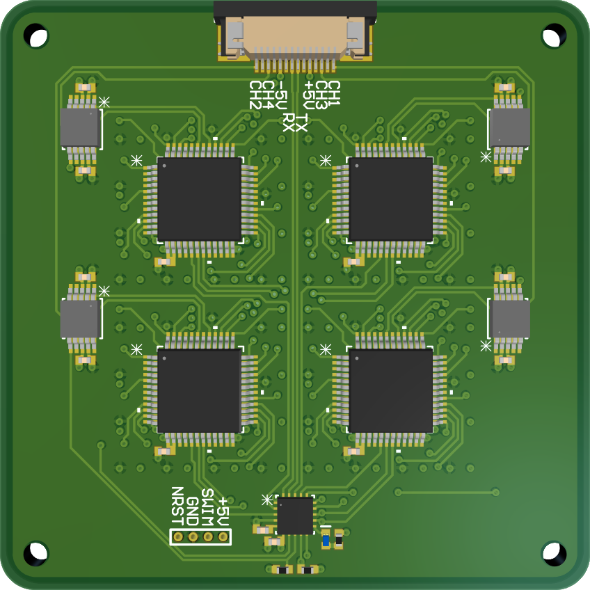
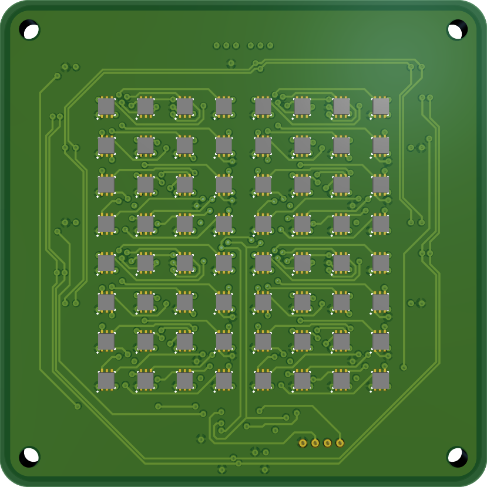
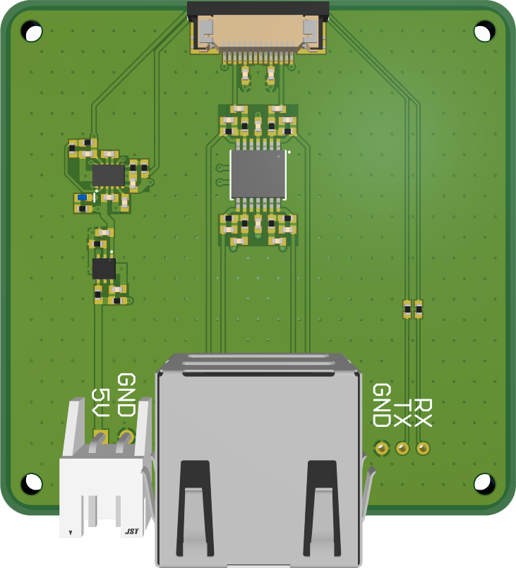

# CT100 Magnetic Sensor Array

An 8×8 array of [CT100](https://www.allegromicro.com/-/media/files/datasheets/ct100-datasheet.pdf) magnetic sensors\
The spacing between sensors is 4 mm

## Hardware

The `sensor-board` directory contains the Altium Designer files for the sensor array PCB\

The `interface-board` directory contains the Altium Designer files for the power regulation and signal amplification PCB that interfaces with the sensor array PCB\

The `coil-board` directory contains the KiCad files for the coil PCB\

## Firmware

The `sensor-board-firmware` directory contains the firmware for the onboard STM8S003F3U6 microcontroller (see [here](sensor-board-firmware/README.md) for more information)

## Software

The `data-acquisition` directory contains the MATLAB App to acquire data