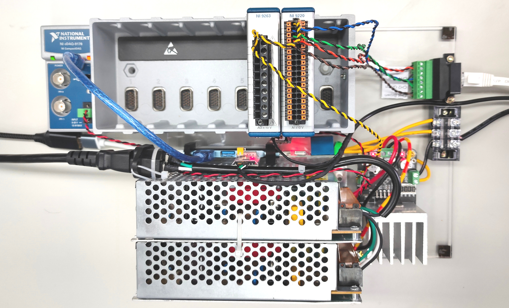

## DAQ connection

- CH 4: Brown
- CH 2: Green
- CH 1: Blue
- CH 3: Orange

## Develop

In **MyHardware.m**
- change the variables `deviceID` in function `connectDAQ` to the proper module ID
- change the variable `friendlyName` in functions `connectSensorSerial` and `connectRelaySerial` to the proper serial port friendly name